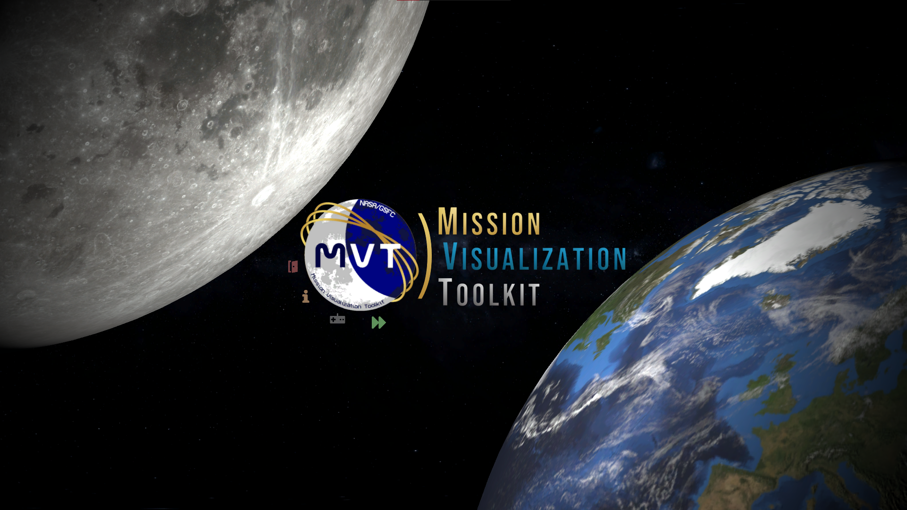

# MVT
The Mission Visualization Toolkit (MVT) is a novel piece of software that seeks to enable efficient and accurate lunar case studies, while being accessible to the general user to appeal to a wider audience.  MVT is a lightweight web tool and application version of the Systems Toolkit (STK) expediting the testing of various “What-If” or hypothetical Lunar network scenarios, specifically the NASA Requirements Analysis Cycle (RAC) studies, impacting Artemis missions 3, 4, 5, and 8.
This season and project would not have been possible without the guidance and support of our mentors: George Bussey and Elana Resnick. We would also like to extend thanks to Jimmy Acevado, Korine Powers, Thomas Montano, Barbara Addey, and Ryan Welsh for their help in various departments over the course of this season. We would also like to thank the NASA Goddard Space Flight Center and NASA's Space Communications and Navigation Program as a whole for making this opportunity possible for us.

## Access MVT
There are two main modes to access MVT.  To access the web version, we recommend using Google Chrome or Mozilla Firefox by navigating to: ~~link is no longer active to due to conclusion of internship~~.  You can also download the standalone build [here](https://drive.google.com/drive/folders/1ncs-kQsdyjm1DDYk4Y8_UNKBJ5t-x-pT)  

## Development
The MVT development team utilizes the game engine Unity paired with the C# programming language to create the primary infrastructure. MVT provides realistic graphics, accurate Lunar terrain, Dynamic Link Visibility (DLV), and scheduling capabilities. Compelling graphics were achieved using custom 3D models of orbiting satellites, designed in Fusion 360, and rendered via Unity’s built in Universal Rendering Pipeline as well as an easy to navigate and friendly user interface. High resolution Lunar terrain was created through compiling a number of Lunar elevation sources with multiple pre-processing steps to create an efficient and optimized 3D Lunar terrain model. DLVs are calculated – taking into account the lunar terrain and body positions in the scenario – to determine when users and providers have an uninterrupted line of sight for communications. A schedule, a list of communication periods between users and providers, is generated by considering the DLVs and potential timing overlaps or conflicts. MVT solves DLVs in real time, which benefits Commercial System for Mission Operation Sustainability (COSMOS) users, allowing more user flexibility with the commercial systems. At its core, MVT produces a mission model for a mission or set of missions, because of that, the web extensibility provides benefit to both the Mission Design Lab and Network Loading and Modeling group.

## Acknowledgements
This program was developed over the course of the 2022 SCaN Internship Project (SIP) internship season by Aman Garg, Aditya Dutt, Arya Kazemnia, Leo Wang, and Zoe Schoeneman-Fry.  Additionally, we would like to thank the International Space Club for funding the internship programs from which we benefitted. Minor parts of this program were derived from a previous, Earth focused build of MVT from the 2021 SIP internship season. Additional code was used with permission from Newtonsoft, NumSharp, ImageSharp, and HtmlAgilityPack.
